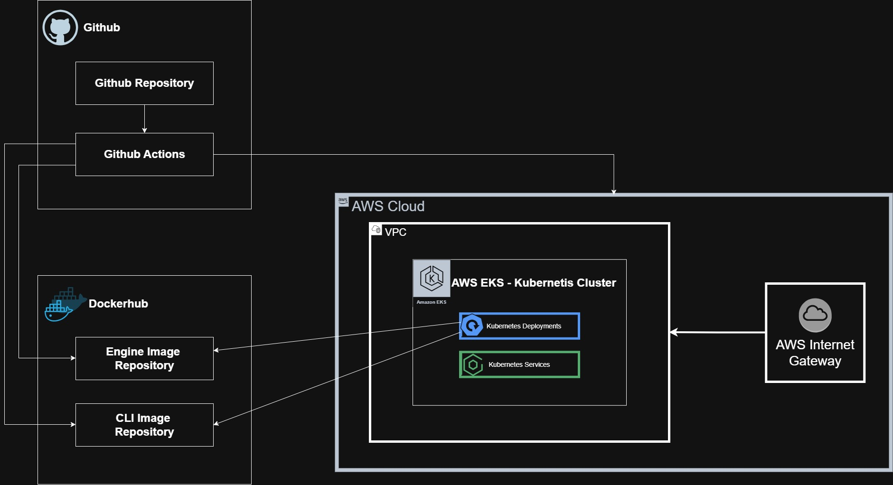
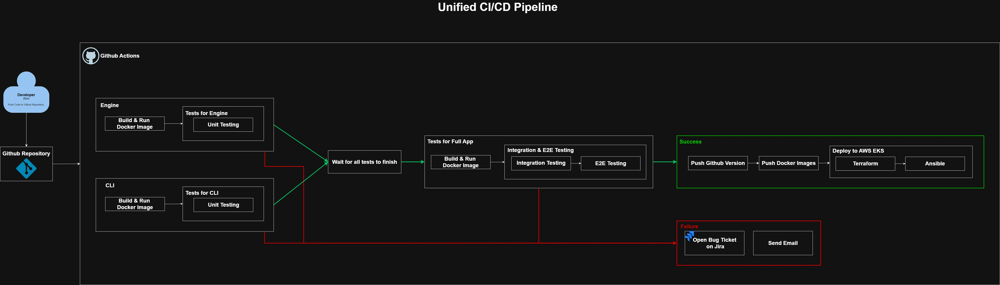
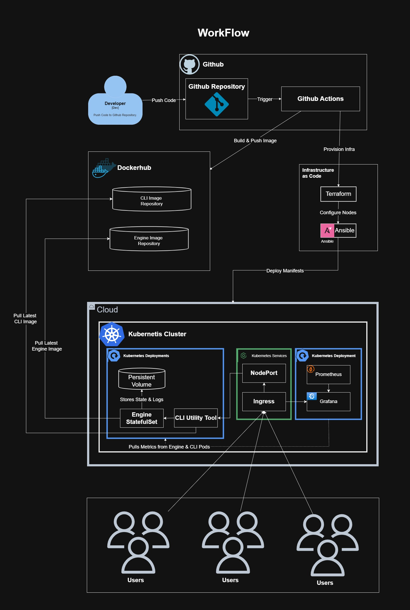

# SeyoAWE Community Edition

## Overview

SeyoAWE Community Edition is a cloud-native workflow automation platform designed to demonstrate modern DevOps engineering practices using:

- Terraform Infrastructure as Code
- AWS EKS Kubernetes clusters
- Amazon EFS shared persistent storage
- Helm deployments
- Ansible automation
- Docker containerization
- GitHub Actions CI/CD
- Monitoring and observability
- Automated testing pipelines

The project was built as a full end-to-end DevOps platform demonstrating:

- infrastructure provisioning
- Kubernetes orchestration
- stateful workloads
- automated deployments
- CI/CD automation
- monitoring integration
- shared storage architecture
- testing automation

---

# Architecture

## High-Level Architecture

```text
GitHub Actions CI/CD
        │
        ▼
Terraform Provisioning
(AWS VPC + EKS + EFS)
        │
        ▼
Ansible Automation
        │
        ▼
Helm Deployments
        │
        ▼
Kubernetes Cluster (EKS)
        │
 ┌──────┼──────┐
 │      │      │
 ▼      ▼      ▼
Engine  CLI  Monitoring
        │
        ▼
Shared Amazon EFS Storage
(Persistent Volumes)
```

## Cloud Architecture



## Cloud Architecture



## Workflow



---

# Features

## Infrastructure as Code

- Modular Terraform architecture
- AWS VPC provisioning
- EKS cluster provisioning
- EFS shared storage provisioning
- Remote Terraform state support

## Kubernetes Platform

- StatefulSet-based engine deployment
- Shared EFS storage
- Helm-managed deployments
- Readiness and liveness probes
- Config checksum rollouts
- Persistent shared workflow storage

## CI/CD Automation

- GitHub Actions pipelines
- Automated unit testing
- Automated integration testing
- Automated E2E testing
- Docker image builds
- Infrastructure deployment automation
- Application deployment automation
- Artifact publishing
- Allure report support

## Monitoring

- Prometheus integration
- Grafana dashboards
- Kubernetes observability
- Service monitoring

## Testing

- Unit tests
- Integration tests
- End-to-end tests
- Pytest markers
- Allure reporting

---

# Technologies Used

| Category | Technologies |
|---|---|
| Cloud | AWS |
| IaC | Terraform |
| Configuration Management | Ansible |
| Container Orchestration | Kubernetes (EKS) |
| Package Management | Helm |
| Containers | Docker |
| CI/CD | GitHub Actions |
| Storage | Amazon EFS |
| Monitoring | Prometheus, Grafana |
| Language | Python |
| Testing | Pytest, Allure |

---

# Repository Structure

```text
.
├── ansible/
│   ├── inventory/
│   ├── playbooks/
│   ├── roles/
│   └── group_vars/
│
├── docker/
│   ├── cli/
│   └── engine/
│
├── k8s/
│   └── helm/
│       └── seyoawe/
│
├── monitoring/
│   ├── grafana/
│   └── prometheus/
│
├── terraform/
│   ├── deploy_infra/
│   │   ├── modules/
│   │   │   ├── eks/
│   │   │   ├── efs/
│   │   │   └── vpc/
│   │   └── environments/
│   │
│   └── remote_state_table/
│
├── tests/
│   ├── unit/
│   ├── integration/
│   └── e2e/
│
├── .github/
│   └── workflows/
│
│── original project/ # all the files and structure from the original repo
│
└── README.md
```

---

# Shared Persistent Storage Design

The platform intentionally uses shared RWX (ReadWriteMany) persistent volumes backed by Amazon EFS.

This allows:

- shared workflows
- shared modules
- shared execution data
- shared logs
- centralized automation assets
- multi-pod access

The shared PVC architecture is intentionally designed for collaborative workflow execution and automation orchestration.

---

# Infrastructure Deployment

## Prerequisites

Before deployment, install:

- AWS CLI
- Terraform
- kubectl
- Helm
- Docker
- Python 3
- Ansible

---

## AWS Credentials

Configure AWS credentials:

```bash
aws configure
```

Or export:

```bash
export AWS_ACCESS_KEY_ID=<YOUR_KEY>
export AWS_SECRET_ACCESS_KEY=<YOUR_SECRET>
export AWS_DEFAULT_REGION=<YOUR_REGION>
```

---

# Terraform Deployment

## Deploy Remote State Table on AWS

Navigate to:

```bash
cd terraform/remote_state_table
```

Initialize Terraform:

```bash
terraform init
```

Deploy tfstate Table:

```bash
terraform apply -auto-approve
```

## Deploy Infrastructure

Navigate to:

```bash
cd terraform/deploy_infra
```

Initialize Terraform:

```bash
terraform init
```

Validate configuration:

```bash
terraform validate
```

Preview infrastructure changes:

```bash
terraform plan
```

Deploy infrastructure:

```bash
terraform apply -auto-approve
```

Terraform provisions:

- VPC
- Subnets
- Security Groups
- EKS Cluster
- EFS Filesystem
- EFS Mount Targets
- IAM integrations

---

# Kubernetes Access

Update kubeconfig:

```bash
aws eks update-kubeconfig \
  --region <REGION> \
  --name <CLUSTER_NAME>
```

Verify cluster access:

```bash
kubectl get nodes
```

---

# Application Deployment

## Deploy with Ansible

Run:

```bash
ansible-playbook \
  -i ansible/inventory/hosts.ini \
  ansible/playbooks/deploy_seyoawe.yaml
```

The deployment process:

1. Authenticates to EKS
2. Creates Kubernetes namespaces
3. Deploys EFS StorageClass
4. Creates persistent volumes
5. Deploys Helm charts
6. Waits for rollout completion
7. Deploys monitoring stack

---

# Helm Deployment

## Manual Helm Deployment

Navigate:

```bash
cd k8s/helm/seyoawe
```

Install:

```bash
helm upgrade --install seyoawe . \
  --namespace seyoawe \
  --create-namespace
```

Verify:

```bash
kubectl get pods -n seyoawe
```

---

# StatefulSet Engine

The engine component is deployed as a Kubernetes StatefulSet.

Features:

- stable pod identity
- persistent shared storage
- ordered rollout handling
- persistent execution state
- shared workflow access

Verify StatefulSet:

```bash
kubectl get statefulsets -n seyoawe
```

---

# Docker

## Build Engine Image

```bash
docker build \
  -f docker/engine/Dockerfile \
  -t seyoawe-engine:latest .
```

## Build CLI Image

```bash
docker build \
  -f docker/cli/Dockerfile \
  -t seyoawe-cli:latest .
```

---

# CI/CD Pipelines

The project uses GitHub Actions for automation.

## CI Pipeline

The CI workflow performs:

#### Engine/CLI Job

- Python dependency installation
- unit tests
- Docker image builds
- artifact uploads
- Allure result generation

#### E2E Job

- waits for successful unit tests
- deploys runtime containers
- validates engine behavior
- validates CLI interaction
- validates workflow execution
- validates integration behavior

##### * Enable Github Pages for Allure Reports

## CD Pipeline

The CD workflow:

- provisions infrastructure
- authenticates to AWS
- deploys Kubernetes resources
- deploys monitoring stack
- validates rollout status

## Secrets - Configure to Run Workflows

 Configure these secrets on *Secrets and Variables* -> *Actions* -> *Repository secrets*:

| Secret | Used by |
|---|---|
| `AWS_ACCESS_KEY_ID`, `AWS_SECRET_ACCESS_KEY` | Terraform + Ansible |
| `DOCKERHUB_USER`, `DOCKERHUB_TOKEN` | CI image push |
| `GRAFANA_PASSWORD` | Monitoring deploy |
| `JIRA_BASE_URL`, `JIRA_USER_EMAIL`, `JIRA_API_TOKEN`, `JIRA_PROJECT_KEY` | CI failure |
| `SMTP_SERVER`, `SMTP_USERNAME`, `SMTP_PASSWORD`, `NOTIFY_EMAIL` | CI failure email |


---

# Testing

## Test Structure

```text
tests/
├── unit/
├── integration/
└── e2e/
```

---

## Run Unit Tests

```bash
pytest tests/unit -m unit -v
```

---

## Run Integration Tests

```bash
pytest tests/integration -m integration -v
```

---

## Run E2E Tests

```bash
pytest tests/e2e -m e2e -v
```

---

# Allure Reports

Generate Allure results:

```bash
pytest --alluredir=allure-results
```

Generate HTML report:

```bash
allure generate allure-results --clean -o allure-report
```

Open report:

```bash
allure open allure-report
```

---

# Monitoring Stack

## Components

The monitoring stack includes:

- Prometheus
- Grafana
- ServiceMonitors
- Prometheus Rules

---

## Access Grafana

Retrieve ingress:

```bash
kubectl get ingress -n monitoring
```

---

# Security Practices

The platform includes:

- non-root containers
- Kubernetes security contexts
- GitHub Actions secrets
- modular infrastructure isolation
- persistent storage separation

---

# Useful Commands

## Kubernetes

Get pods:

```bash
kubectl get pods -A
```

Describe pod:

```bash
kubectl describe pod <POD_NAME>
```

View logs:

```bash
kubectl logs <POD_NAME>
```

Restart rollout:

```bash
kubectl rollout restart statefulset/seyoawe-engine
```

---

## Helm

List releases:

```bash
helm list -A
```

Upgrade release:

```bash
helm upgrade seyoawe .
```

---

## Terraform

Destroy infrastructure:

```bash
terraform destroy -auto-approve
```

---

# Learning Objectives Demonstrated

This project demonstrates:

- Infrastructure as Code
- Kubernetes orchestration
- Stateful application deployment
- Shared persistent storage design
- CI/CD automation
- Containerization
- Monitoring and observability
- Automated testing
- Cloud-native deployment architecture
- DevOps platform engineering

---

# License

This project is intended for educational and DevOps learning purposes.

---

# Acknowledgements

Built using:

- AWS
- Kubernetes
- Terraform
- Helm
- Ansible
- Docker
- GitHub Actions
- Prometheus
- Grafana
- Python


---

# Author

assafNW

