# Proof of Deployment

This document contains screenshots demonstrating successful deployment, CI/CD execution, monitoring, reporting, and failure-notification workflows.

## CI Pipeline

### CI Pipeline - Failure

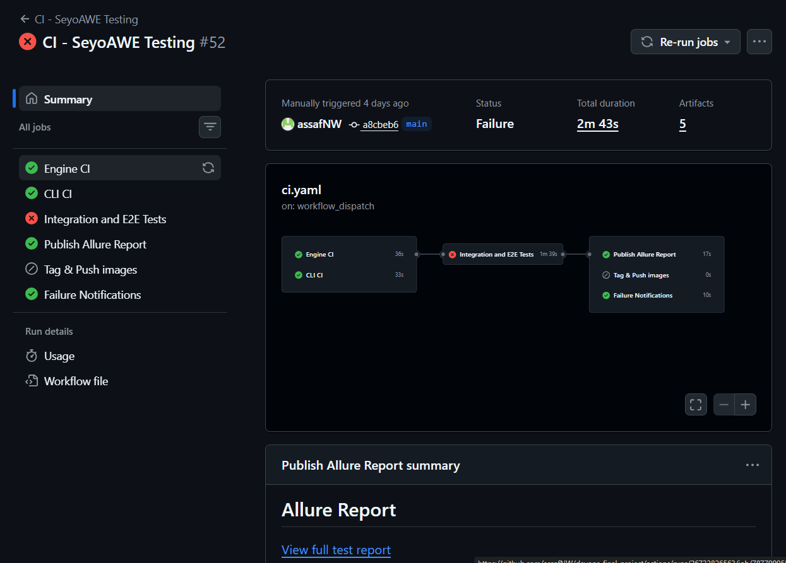

### CI Pipeline - Failure Email

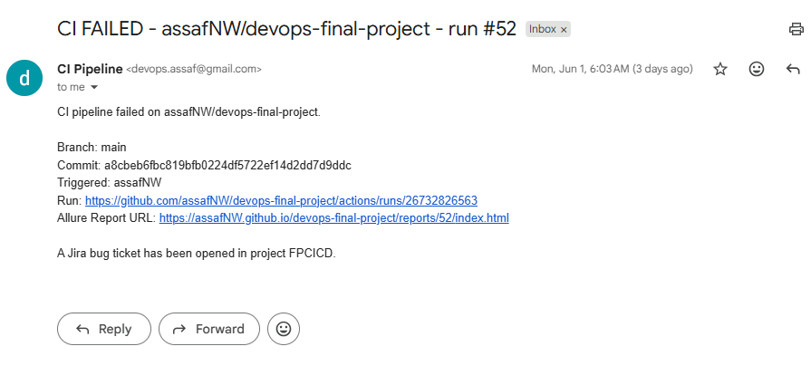

### CI Pipeline - Failure - Jira Message

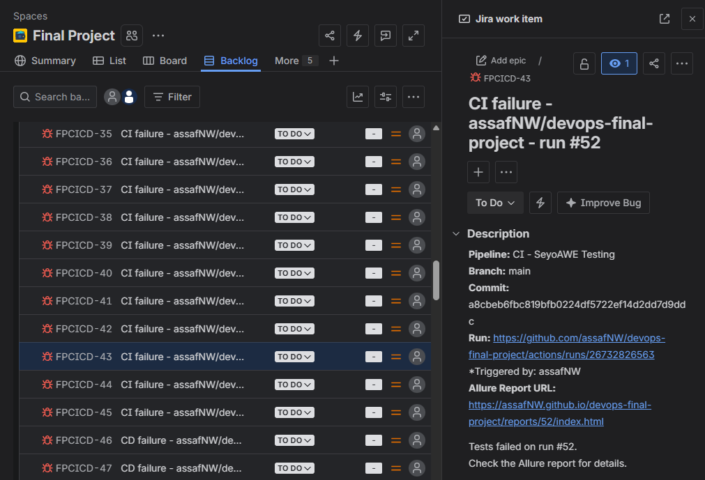

### CI Pipeline - Success

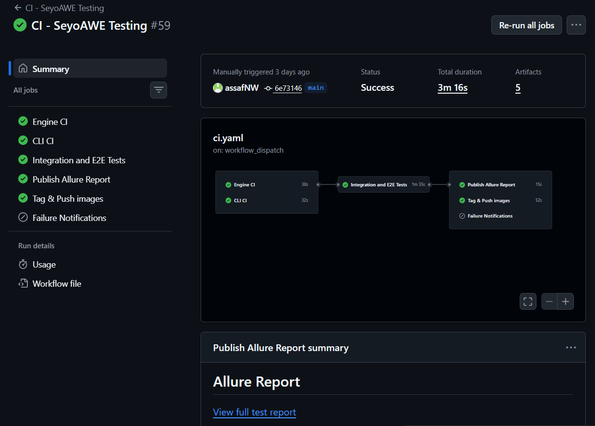

### CI Pipeline - Success Email

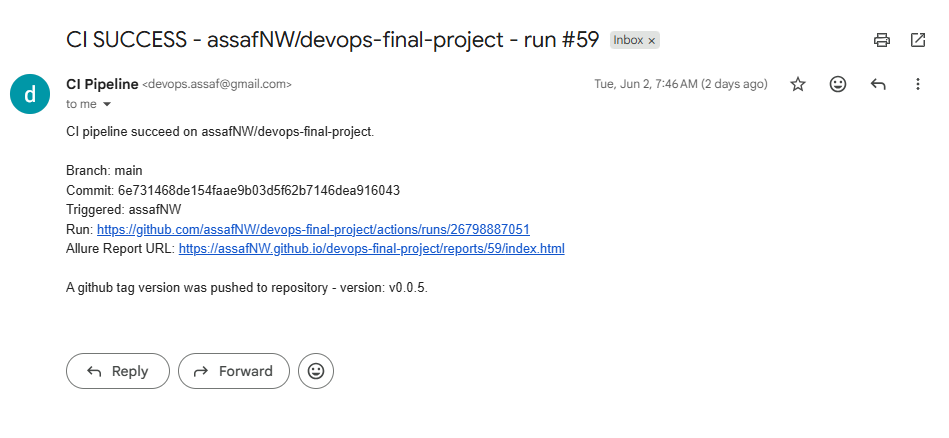

## CD Pipeline

### CD Pipeline - Failure Email

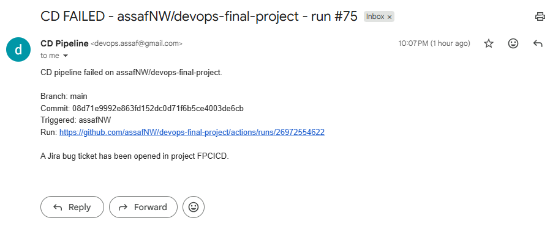

### CD Pipeline - Failure - Jira Message

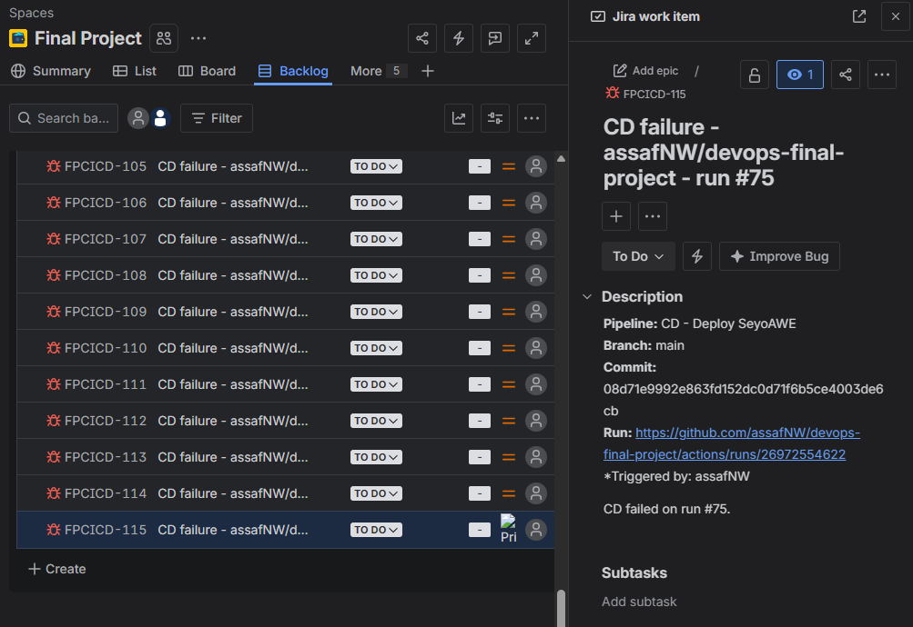

### CD Pipeline - Success

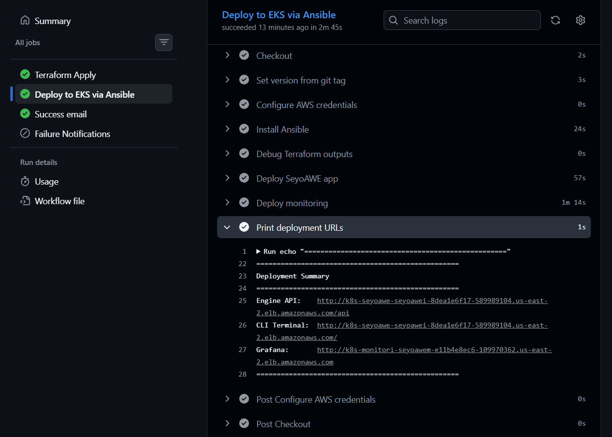

### CD Pipeline - Success Email

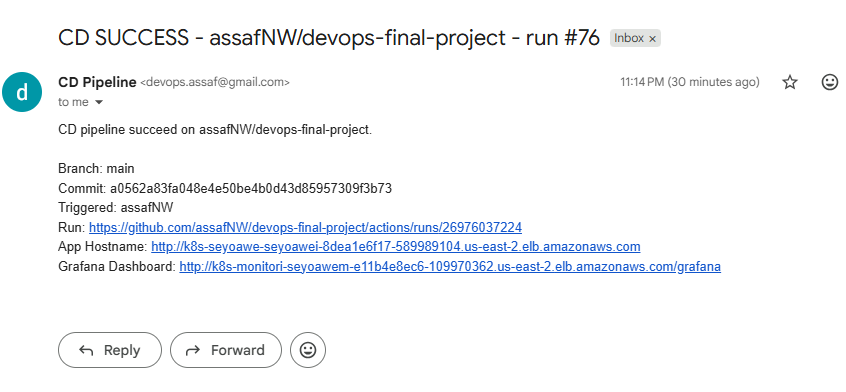

## Infrastructure & Deployment

### Destroy Eks And Infra Pipeline - Success

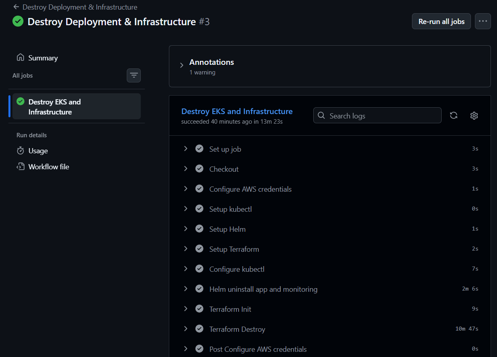

### Ttyd/Sawectl - Pvcs Mounts and Running Workflow

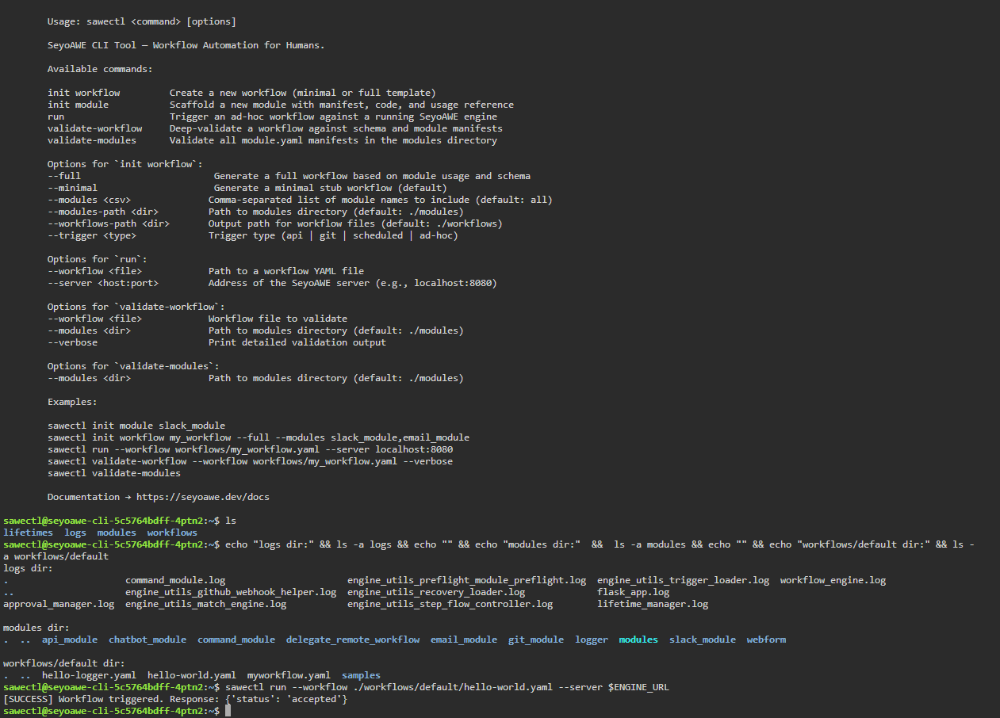

## Monitoring

### Grafana Dashboard

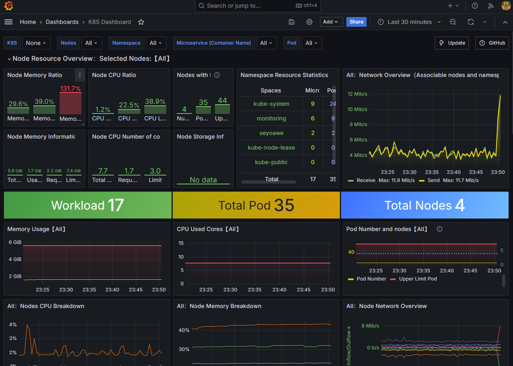

## Test Reports

### Allure Report - Failure

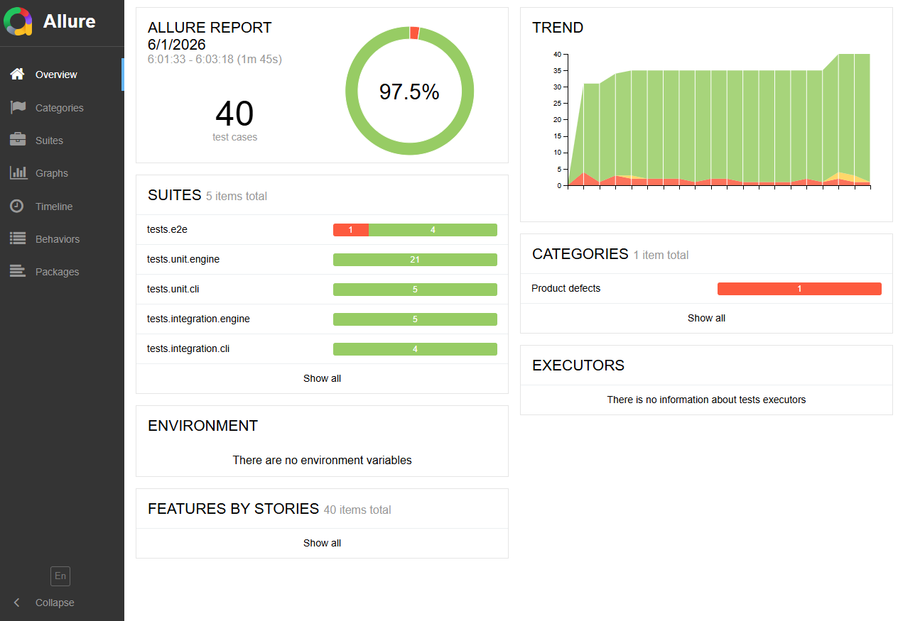

### Allure Report - Success

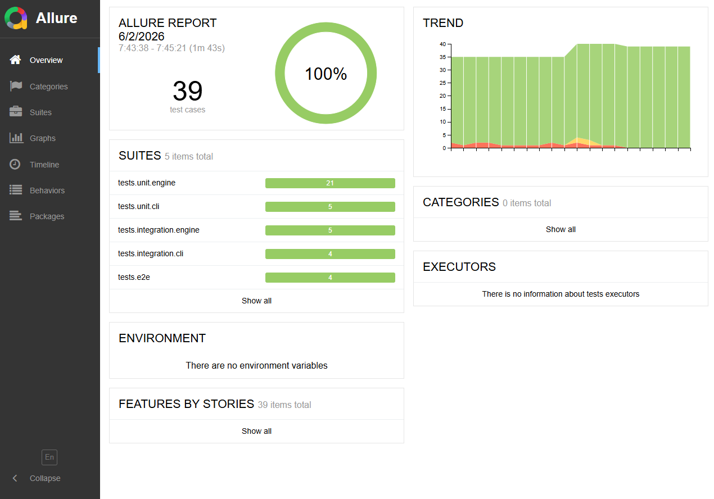
